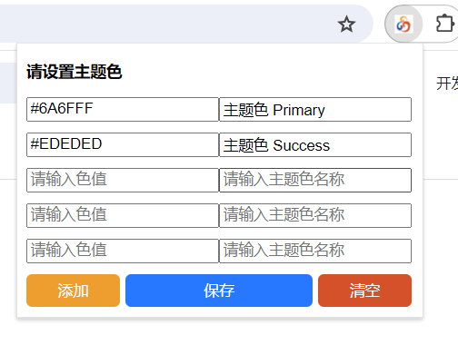
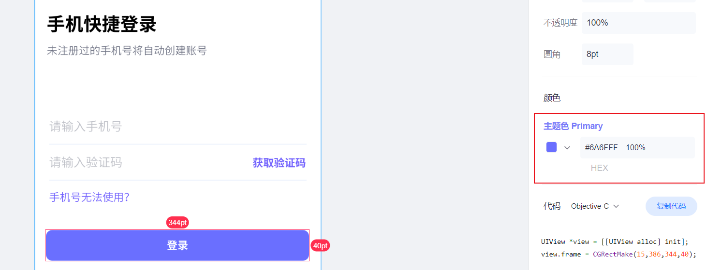
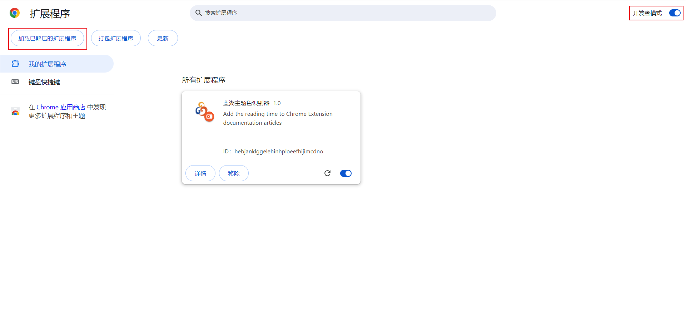

<div align="center">


蓝湖主题色识别器（插件）

</div>


## 简介

蓝湖主题色识别器是一款在蓝湖上显示主题色的Chrome插件

点击图标按钮弹出设置页面，支持自定义色值和名称



自动识别出主题色色值和名称



## 开始

1.使用`git clone`克隆到本地

```js
git clone https://github.com/Liang-Yaxin/themeColor.git
```

2.在Chrome浏览器上导入文件

